# DevQuest PK

<p align="center">
  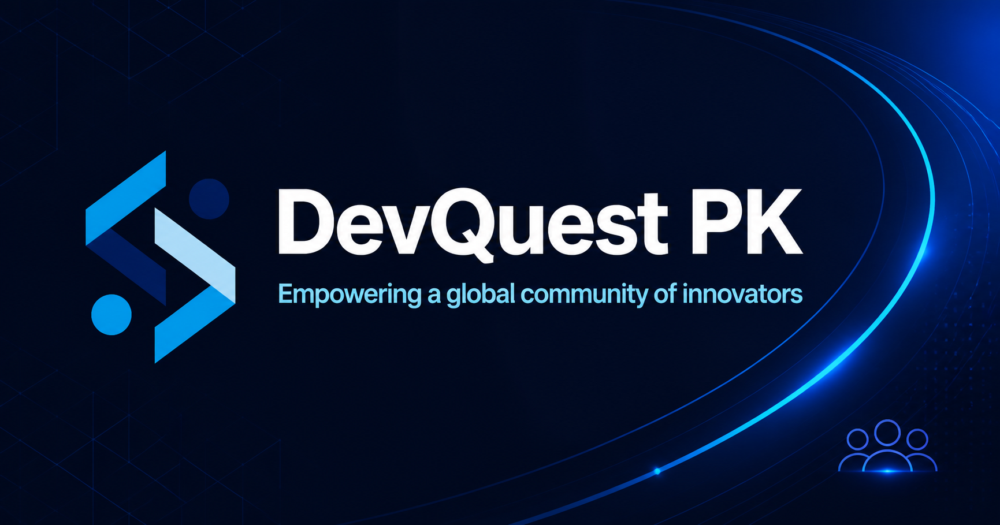
</p>

<p align="center">
  <strong>Learn. Build. Lead.</strong><br />
  Bridging academia and the global technology industry through practical learning, community, and digital services.
</p>

<p align="center">
  <a href="https://www.devquestpk.com">Live website</a> |
  <a href="https://pk.linkedin.com/company/devquest-pk">LinkedIn</a> |
  <a href="https://www.instagram.com/devquestpk/">Instagram</a> |
  <a href="https://www.youtube.com/@DevQuestPK">YouTube</a>
</p>

## About DevQuest

DevQuest PK is a Pakistan-based technology community and services company headquartered in Multan. It connects students, early-career developers, mentors, universities, and industry partners through inclusive learning, hands-on projects, community events, career opportunities, and dependable digital delivery.

The company works across three connected areas:

| Area | What DevQuest provides |
| --- | --- |
| **Learn** | Mentorship, bootcamps, technical sessions, certifications, and peer learning. |
| **Build** | Software development, UI/UX design, cloud/API solutions, and project collaboration. |
| **Lead** | Campus chapters, ambassador opportunities, careers, partnerships, and team operations. |

The website serves as both the public face of the company and an operational platform for its team.

## Website Features

### 1. Company Homepage

The homepage introduces DevQuest's mission and gives visitors a complete path into the organization:

- Company positioning and community impact statistics.
- Direct access to software, design, and talent services.
- Mentorship, certification, career preparation, and community programs.
- Events, academy programs, partners, sponsors, and current vacancies.
- Contact and partnership enquiries.
- WhatsApp community and event registration links.

### 2. Technology Services

<p align="center">
  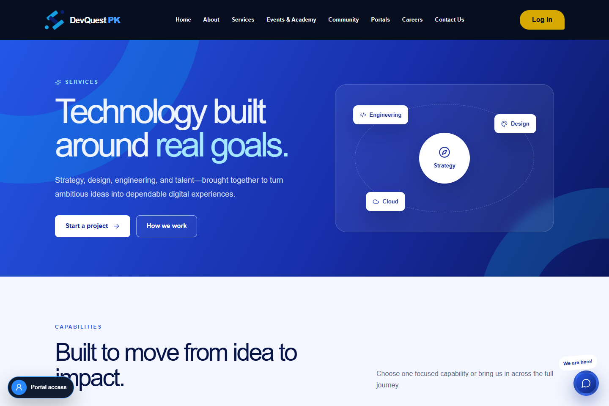
</p>

DevQuest presents three commercial capabilities:

| Service | Included capabilities |
| --- | --- |
| **Software development** | Product discovery, responsive web applications, cloud and API architecture, QA, and long-term support. |
| **UI/UX design** | Experience audits, user research, information architecture, prototypes, design systems, and developer handoff. |
| **Talent augmentation** | Skill mapping, screening, flexible engagement, and mentor-supported onboarding. |

The services page also explains the four-stage delivery process: **Discover, Shape, Build, and Grow**.

### 3. Events and Academy

<p align="center">
  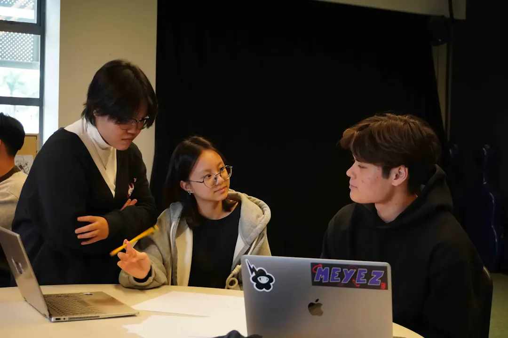
  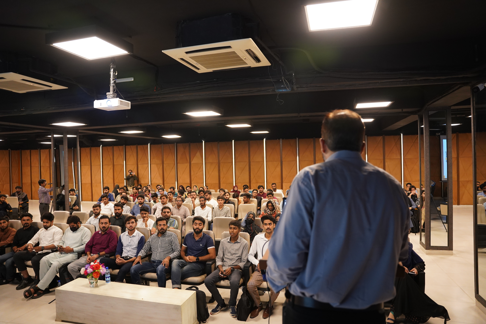
</p>

The Events & Academy experience includes:

- **Innovate Pakistan**, a flagship hybrid technology series.
- **TechTrivium**, a collaborative campus technology experience.
- Past learning highlights such as E-Course Farewell and Tech in Ramadan.
- Foundation tracks for Next.js, Git, and backend design.
- WhatsApp registration and event-update actions.
- A campus partnership path for universities and student communities.

### 4. Community and University Network

<p align="center">
  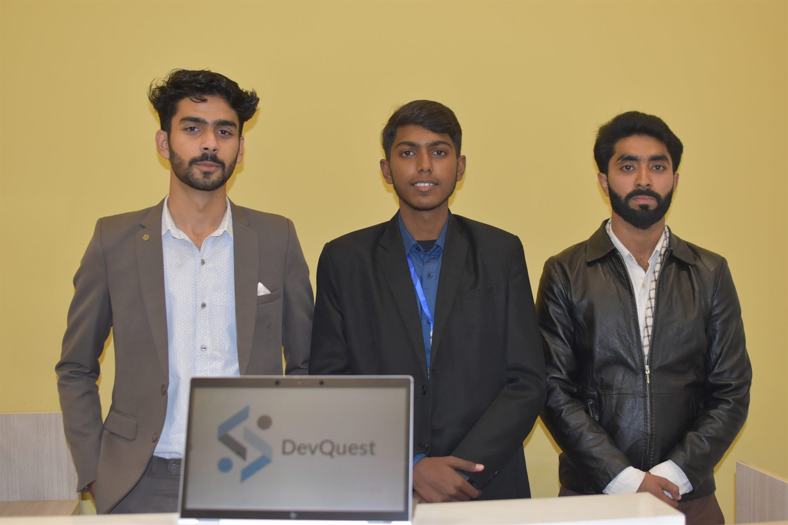
  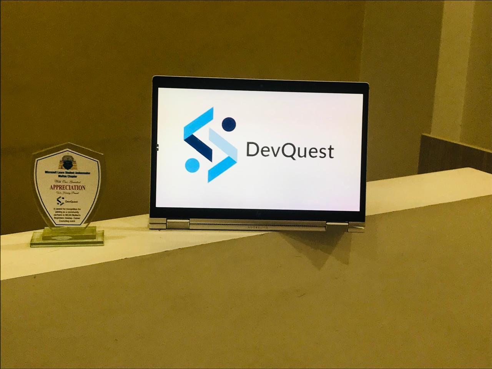
  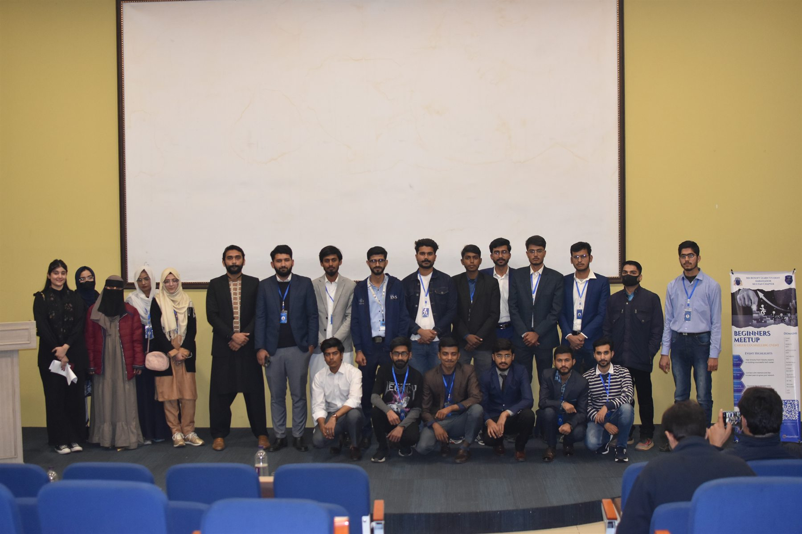
</p>

The community area is built for students, developers, mentors, and technology enthusiasts. It provides:

- A public overview of the growing DevQuest network.
- Community principles focused on open learning, collaboration, and impact.
- University presence at Bahauddin Zakariya University and MNS University of Engineering & Technology.
- Leadership, official, and core team profiles with professional links.
- A path for new universities to launch DevQuest campus activity.
- Direct WhatsApp access to the community.

### 5. Careers and Campus Ambassadors

<p align="center">
  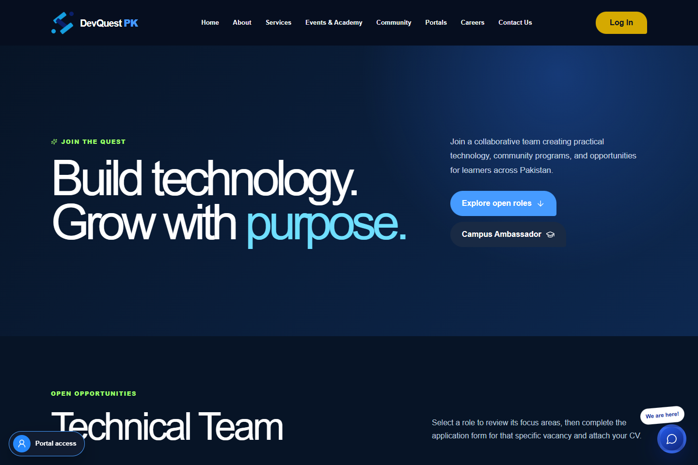
</p>

The careers system supports role-specific hiring and student leadership applications.

Current role pages are generated for:

- Tech Lead / Full-Stack Developer.
- Frontend & UI/UX Developer.
- Cloud & AI Solutions Engineer.
- Business Development Executive.

Each vacancy automatically opens the correct application page and includes required experience fields, education details, availability, portfolio links, and CV upload.

The Campus Ambassador program includes a separate application workflow for university students who want to organize events, grow a campus community, and represent DevQuest.

Application safeguards include:

- PDF, DOC, and DOCX validation.
- A maximum CV size of 5 MB.
- Required consent and minimum response lengths.
- Honeypot spam protection.
- Server-side position validation.
- Direct email delivery to the official DevQuest inbox.

### 6. Contact and Partnership Enquiries

The contact page supports structured enquiries for:

- General questions.
- Software development.
- UI/UX design.
- Talent augmentation.
- Academy and event collaboration.
- Partnerships.

Visitors can provide their company or university, phone number, budget range, and project details. Submissions are delivered through the website API using Resend, with reply-to information preserved for the DevQuest team.

### 7. Role-Based Portal Access

<p align="center">
  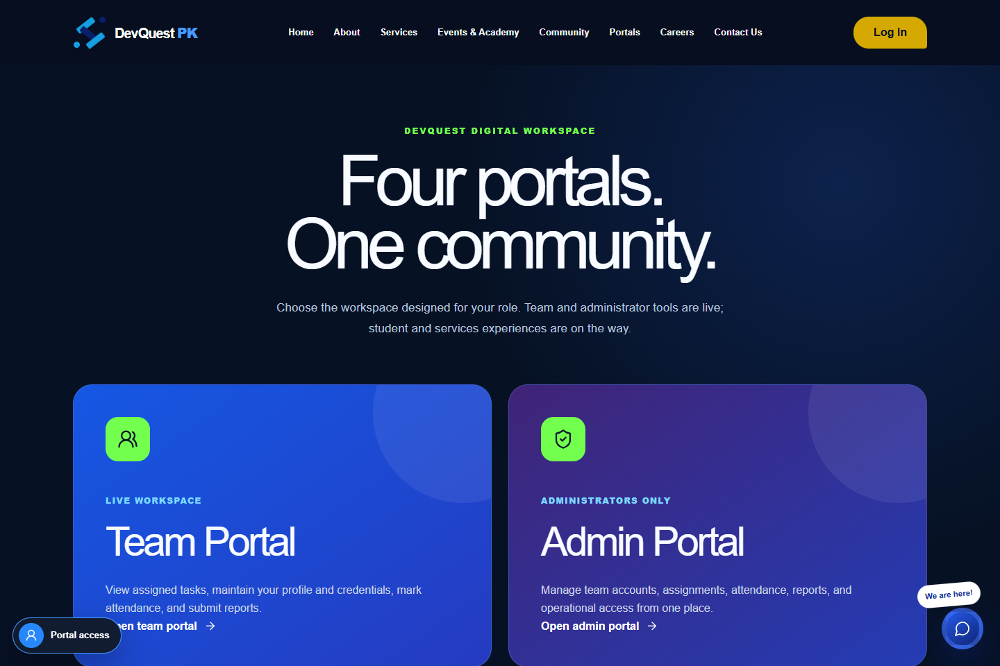
</p>

The portal selector routes each approved account to the correct workspace. Authentication is powered by Supabase Auth and validates both the account role and active status before access is granted.

| Portal | Status | Purpose |
| --- | --- | --- |
| **Team Portal** | Live | Personal tasks, profile, credentials, attendance, and reports. |
| **Admin Portal** | Live | Team accounts, assignments, attendance oversight, reports, and access control. |
| **Services Portal** | Coming soon | Client requests, project communication, milestones, and delivery updates. |
| **Student Portal** | Coming soon | Learning paths, events, certificates, opportunities, and progress. |

Portal accounts are issued by DevQuest administrators; there is no unrestricted public registration for operational workspaces.

### 8. Team Portal

Every approved team member receives an isolated workspace with:

- Assigned task list with priority, due date, and status updates.
- Editable name, department, job title, phone number, and biography.
- JPG, PNG, or WebP profile image upload through Supabase Storage.
- Secure password changes through Supabase Auth.
- Daily check-in/check-out and personal attendance history.
- Daily, weekly, or monthly progress reports.
- Achievement, blocker, and next-step reporting.
- Global sign-out controls.

### 9. Admin Portal

Administrators can manage the team from a single dashboard:

- View team, open-task, attendance, and report totals.
- Create individual team accounts with temporary credentials.
- Activate or deactivate member access.
- Update member roles and profile information.
- Create, assign, prioritize, schedule, and delete tasks.
- Review attendance records across the team.
- Review submitted progress reports and blockers.
- Access server-protected member administration endpoints.

### 10. Shared Platform Experience

The complete site includes:

- Responsive desktop and mobile navigation.
- Shared company header, footer, contact information, and social links.
- Floating WhatsApp contact access.
- Page-specific SEO metadata.
- Open Graph and Twitter preview images.
- Accessible labels, focusable controls, semantic forms, and status messages.
- Reusable loading, success, error, and empty states.

## Partners and Community Support

<p align="center">
  
  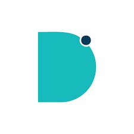
  
  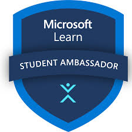
  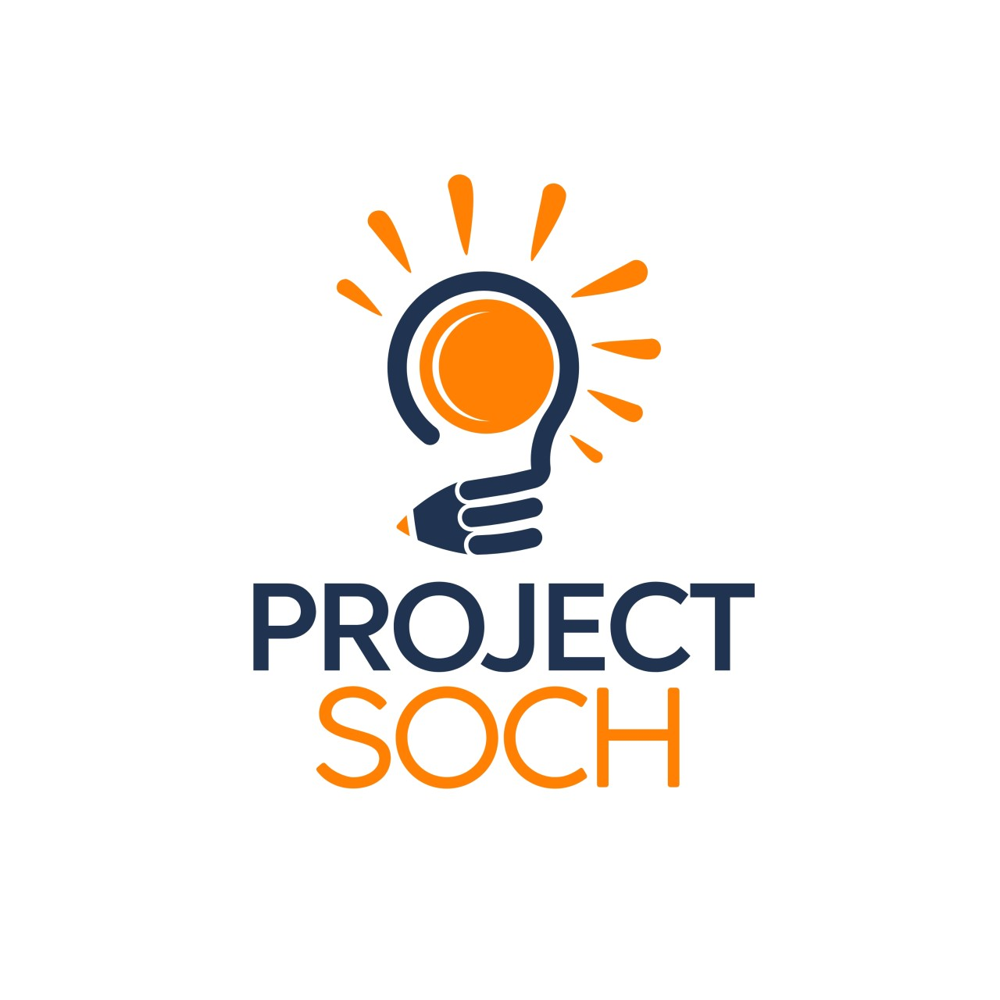
</p>

The site highlights a wider network of university groups, technology communities, and supporting organizations stored under `public/partners/`.

## Route Map

| Route | Experience |
| --- | --- |
| `/` | Company homepage and full platform overview |
| `/about` | Company officials, leadership, and core team |
| `/services` | Development, design, talent, and delivery process |
| `/events` | Events, academy, bootcamp tracks, and registration |
| `/community` | Community values, university chapters, and team |
| `/careers` | Open roles and Campus Ambassador application |
| `/careers/apply/[slug]` | Role-specific career application |
| `/contact` | Project, academy, and partnership enquiries |
| `/portal` | Portal selection hub |
| `/portal/team` | Authenticated team workspace |
| `/portal/admin` | Authenticated administration workspace |
| `/portal/services` | Services Portal preview |
| `/portal/student` | Student Portal preview |

## Technology Stack

| Layer | Technology |
| --- | --- |
| Application | Next.js 16, React 19, TypeScript |
| Runtime/build | vinext, Vite 8, Cloudflare tooling |
| Styling | Tailwind CSS 4 plus project CSS |
| Icons | Lucide React |
| Authentication and data | Supabase Auth, Postgres, Row Level Security, Storage |
| Forms and email | Next.js route handlers and Resend |
| Database tooling | Drizzle ORM and Drizzle Kit |
| Deployment | Vercel-compatible Next.js build and vinext build output |

## Getting Started

### Prerequisites

- Node.js `>=22.13.0`
- npm
- A Supabase project for portal features
- A Resend API key for website form delivery

### Install and run

```bash
git clone https://github.com/devquestpk-web/Devquestweb.git
cd Devquestweb
npm install
cp .env.example .env.local
npm run dev
```

Open [http://localhost:3000](http://localhost:3000).

On Windows PowerShell, use this instead of `cp`:

```powershell
Copy-Item .env.example .env.local
```

## Environment Variables

```dotenv
NEXT_PUBLIC_SUPABASE_URL=
NEXT_PUBLIC_SUPABASE_ANON_KEY=
SUPABASE_SERVICE_ROLE_KEY=
RESEND_API_KEY=
FORM_RECIPIENT_EMAIL=hello@devquestpk.com
FORM_APPLICATION_RECIPIENT_EMAIL=careers@devquestpk.com
FORM_FROM_EMAIL=DevQuest PK <no-reply@devquestpk.com>
GOOGLE_SHEETS_WEBHOOK_URL=
GOOGLE_SHEETS_WEBHOOK_SECRET=
```

| Variable | Purpose |
| --- | --- |
| `NEXT_PUBLIC_SUPABASE_URL` | Supabase project URL used by browser clients. |
| `NEXT_PUBLIC_SUPABASE_ANON_KEY` | Public Supabase key used with Row Level Security. |
| `SUPABASE_SERVICE_ROLE_KEY` | Server-only key for administrator account management. |
| `RESEND_API_KEY` | Sends contact, ambassador, and career submissions. |
| `FORM_RECIPIENT_EMAIL` | Inbox that receives website submissions. |
| `FORM_FROM_EMAIL` | Verified sender identity used by Resend. |
| `GOOGLE_SHEETS_WEBHOOK_URL` | Deployed Google Apps Script `/exec` URL that records website form submissions. |
| `GOOGLE_SHEETS_WEBHOOK_SECRET` | Server-only shared secret used to authenticate Sheet writes. |

Never expose `SUPABASE_SERVICE_ROLE_KEY` or `RESEND_API_KEY` in client-side code or commit `.env.local`.

## Google Sheets Query Automation

Website forms can also be recorded in the `DevQuest Website Queries` spreadsheet owned by the DevQuest Google account. Contact enquiries, campus ambassador applications, and job applications are routed to separate tabs with form-specific columns. Uploaded CVs are saved in the private `DevQuest Website Uploads` Drive folder and linked from the matching application row.

1. Open the spreadsheet, then choose **Extensions > Apps Script**.
2. Replace `Code.gs` with the contents of `docs/google-apps-script.gs` and save it.
3. In **Project Settings > Script Properties**, add `WEBHOOK_SECRET` with a new long random value.
4. Choose **Deploy > New deployment > Web app**. Set **Execute as** to **Me** and **Who has access** to **Anyone**, then deploy and authorize its Google Sheets and Drive access.
5. Copy the deployed URL ending in `/exec` into `GOOGLE_SHEETS_WEBHOOK_URL` and put the same random value in `GOOGLE_SHEETS_WEBHOOK_SECRET` in the website's server environment.
6. Redeploy the website and submit one test entry from each form. New rows should appear in `Website Queries`, `Campus Ambassadors`, and `Job Applications` respectively. Application rows should include a clickable CV document link.

The webhook accepts only requests containing the shared secret, de-duplicates retries by submission ID, and escapes formula-like input before writing it to the Sheet.

## Supabase Setup

1. Create a Supabase project.
2. Run `supabase/schema.sql` in the Supabase SQL editor.
3. Run `supabase/profile-avatar-migration.sql` for team profile image storage.
4. Run `supabase/application-tracking.sql` to enable private Career and Campus Ambassador application tracking.

Tracked applicants receive a private link and tracking ID after submitting. They can return to **Application Status** later and look up the application with that ID. Administrators manage the pipeline from **Admin Portal → Applications**, and status changes appear on the applicant page automatically. Keep `SUPABASE_SERVICE_ROLE_KEY` server-only; never expose it through a `NEXT_PUBLIC_` variable.
5. Add the Supabase URL, anon key, and service-role key to `.env.local`.
6. Create the first administrator profile with the `admin` role.

The schema defines profiles, team tasks, attendance, reports, role checks, and Row Level Security policies. Team members can access their own operational records, while administrators receive organization-wide management access.

## Available Commands

```bash
npm run dev          # Start the local vinext development server
npm run build        # Create a production vinext build
npm run vercel-build # Create a Next.js build for Vercel
npm run lint         # Run ESLint
npm test             # Run the production build verification
npm run db:generate  # Generate Drizzle migrations
```

## Project Structure

```text
app/
  api/                 Website forms and protected admin endpoints
  components/          Shared navigation, footer, forms, and account access
  careers/             Vacancies and application workflows
  portal/              Team, admin, services, and student workspaces
  about/               Company and team profiles
  community/           Community and university network
  events/              Academy programs and events
  services/            Commercial services and delivery process
public/
  events/              Community photography
  figma/               Brand, team, program, and event artwork
  partners/            Partner and sponsor logos
supabase/              Database schema and storage migration
docs/images/           README feature screenshots
```

## Contact

- **Email:** [hello@devquestpk.com](mailto:hello@devquestpk.com)
- **Phone / WhatsApp:** [+92 370 4489589](https://wa.me/923704489589)
- **Location:** Multan, Pakistan
- **LinkedIn:** [DevQuest PK](https://pk.linkedin.com/company/devquest-pk)
- **Instagram:** [@devquestpk](https://www.instagram.com/devquestpk/)
- **Facebook:** [DevQuest PK Official](https://www.facebook.com/DevQuestPKOfficial)
- **YouTube:** [@DevQuestPK](https://www.youtube.com/@DevQuestPK)

---

Copyright 2026 DevQuest Pakistan. All rights reserved.
